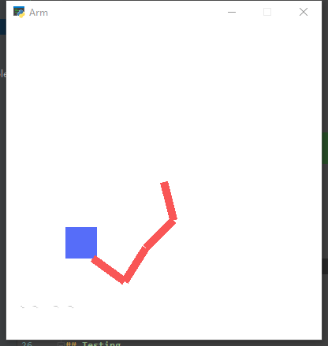
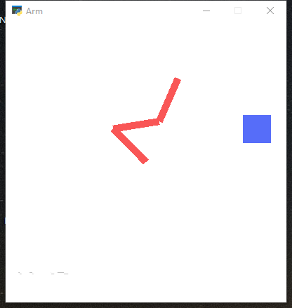

# Robot Arm Environment for Reinforcement Learning 

Multi arms setup for training an Reinforcement Learning algorithm.






## Install 

```shell script
git clone https://github.com/MorvanZhou/RLarm
cd RLarm 
pip3 install -r requirments.txt
```

## Training

state: distance to goal for each join, angle to goal for each join, if touches goal
All distances to goal are normalized to a range of \[0, 1].
All angles to goal are normalized to a range of \[-1, 1].
1 (touches) / -1 (not touches) is the last state.

State example:
`array([ 0.04573185,  0.13328803, -0.03580408,  0.47065321, -1.        ])`
 
Train command:

```shell script
# train with 3 arms
python3 main.py -n 3

# train with 2 arms and hide window
python3 main.py -n 2 --hide 
```

-n: number of arms

## Testing
After training, run following command to test the last stored model.

```shell script
# load 3 arms on 340 epoch
python3 main.py -n 3 --load 340
```